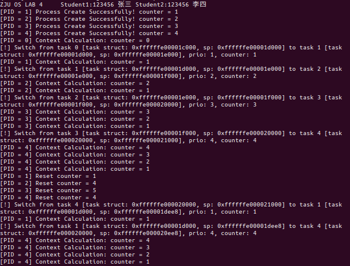

# Lab 4: RISC-V 虚拟内存管理

## 1 实验目的

结合课堂学习的页式内存管理以及虚拟内存的相关知识，尝试在已有的程序上开启 MMU 并实现页映射，保证之前的进程调度能在虚拟内存下正常运行。

## 2 实验内容及要求

* 实现Sv39分配方案下的三级页表映射
* 了解页表映射的权限机制，设置不同的页表映射权限，完成对section的保护及相应的异常处理。

**【！！注意！！】本次实验由于涉及MMU机制较为复杂，考虑之下取消了OpenSBI相关内容，直接使用汇编语言实现制造时钟中断，同学们需要先整体看一遍提供的代码，可以结合之前学习的知识以及代码中的注释理解该过程。**

请各位同学独立完成实验，任何抄袭行为都将使本次实验判为0分。请查看文档尾部附录部分的背景知识介绍，跟随实验步骤完成实验，以截图的方式记录命令行的输入与输出，注意进行适当的代码注释。如有需要，请对每一步的命令以及结果进行必要的解释。**本实验将进行查重，请提供一定的代码注释。**

最终提交的实验报告请命名为“**学号1_姓名1\_学号2\_姓名2\_lab4.pdf**"，代码文件请根据给出的结构整理好后打包命名为“**学号1_姓名1\_学号2\_姓名2\_lab4**"，分开上传至学在浙大平台。

本实验以双人组队的方式进行，**仅需一人提交实验，**默认平均分配两人的得分（若原始打分为X，则可分配分数为2X，平均分配后每人得到X分）。如果有特殊情况请单独向助教反应，出示两人对于分数的钉钉聊天记录截图。单人完成实验者的得分为原始打分。

| 姓名 | 学号 | 分工 | 分配分数 |
| ---- | ---- | ---- | -------- |
|      |      |      | 50%      |
|      |      |      | 50%      |

## 3 实验步骤 

### 4.1 实验背景

#### 4.1.1 建立映射

同lab3的文件夹映射方法，目录名为lab4。

#### 4.1.2 组织文件结构

```
lab4
├── arch
│   └── riscv
│       ├── boot
│       ├── include
│       │   ├── put.h
│       │   ├── sched.h
│       │   └── vm.h
│       ├── kernel
│       │   ├── entry.S
│       │   ├── head.S
│       │   ├── Makefile
│       │   ├── sched.c
│       │   ├── strap.c
│       │   ├── vm.c
│       │   └── vmlinux.lds
│       └── Makefile
├── include
│   ├── put.h
│   └── rand.h
├── init
│   ├── main.c
│   └── Makefile
├── lib
│   ├── Makefile
│   ├── put.c
│   └── rand.c
└── Makefile
```

**本次实验中将设置satp寄存器开启Sv39内存分配方案，随后设置物理地址与虚拟地址的映射，最后为不同section设置不同的映射权限，并实现相应的异常处理。为了实现映射，同学们需要分配内存空间给页表，并对页表项进行相应的设置。由于开启了MMU，还需要对进程调度的相关代码进行一定的修改。**

本次实验由于涉及MMU机制较为复杂，考虑之下取消了OpenSBI相关内容，直接使用汇编语言实现制造时钟中断，同学们需要先整体看一遍提供的代码，可以结合之前学习的知识以及代码中的注释理解该过程。

#### 4.1.3 Sv39分配方案（20%）

本次实验使用Sv39分配方案，支持三级页表映射，请首先阅读**【附录A.虚拟内存及分页机制】**、**【附录B. RISC-V Sv39 分页方案】**中的内容，确保自己已经理解了相关内容，再进行后续实验。

### 4.2 修改head.S

#### 4.2.1 修改系统启动部分代码

**提示：**`vmlinux.lds`中规定将内核放在物理内存`0x80000000`、虚拟内存`0xffffffe000000000`的位置，因此物理地址空间下的地址x在虚拟地址空间下的地址为`x-0x80000000+0xfffeee000000`。

**请严格按照下述顺序进行编写！**

- 在`_supervisor`开头先设置`satp`寄存器为0，暂时关闭MMU
- 设置`stvec`为异常处理函数`trap_s`在**虚拟地址空间下**的地址
- 记录`start_kernel`在**虚拟地址空间下**的地址，加载到寄存器中
- 设置`sp`的值为`stack_top`的物理地址（设置低地址空间栈环境）
- 调用`paging_init`函数进行映射
- 设置`satp`的值以打开MMU，注意修改`satp`后需要执行`sfence.vma`指令同步虚拟内存相关映射
- 设置`sp`的值为虚拟地址空间下的`init_stack_top`
- 使用`jr`指令跳转到虚拟地址下的`start_kernel`（读取之前记录在寄存器中的值），并在虚拟地址空间中执行后续语句与进程调度

```asm
_supervisor:
	/*your code*/
	
	
```

<u>**Q1：satp的值应当设置为?(提示：映射时将从`_end`开始为页表分配物理空间)**</u>

答：


#### 4.2.2 修改M模式下异常处理代码

该小节代码已提供，仅需理解即可。

- 由于M模式下依然使用物理地址，使用虚拟地址将导致内存访问错误。因此，需要保留一片物理地址区域用于异常处理前保存所有寄存器的值。
- `mscratch`寄存器是M mode下专用的临时寄存器。通常，它就用于保存M mode下上下文物理空间的地址。lds文件中分配出了1个page的空间用于储存进程上下文，其顶部标记为`stack_top`，在head.S进入S mode之前的适当位置，将`mscratch`寄存器设置为`stack_top`的物理地址。
- 在M mode异常处理函数`trap_m`的开头，将`mscratch`与`sp`寄存器的值交换（hint: 使用`csrrw`指令），使用上下文空间作为`trap_m`的栈并保存`x1-x31`寄存器。
- 在`trap_m`返回前将`mscratch`与`sp`寄存器的值重新交换回来。

### 4.3 实现映射机制

#### 4.3.1 创建映射

为了增加一个虚拟地址到物理地址的映射，根据Rv39分配方案中的地址翻译规则，首先需要**根据根页表基地址以及虚拟地址找到相应页表项的地址，并在该过程中为页表分配物理页面，随后根据物理地址及映射的权限设置页表项具体的值**，使得后续MMU工作时能够根据根页表基地址和虚拟地址得到正确的物理地址。

在 `vm.c`中编写函数 `create_mapping(uint64 *pgtbl, uint64 va, uint64 pa, uint64 sz, int perm)`，用作页表映射的统一接口，其中参数作用如下：

- `pgtbl`为根页表的基地址
- `va`,`pa`分别为需要映射的虚拟、物理地址的基地址
- `sz`为映射的大小
- `perm`为映射的读写权限

对于多级页表，父节点页表项存储的值是第一个子节点的位置,而同一个节点的子节点是连续存储的，理论上只需要根节点我们就能得到所有页表项的地址。因此可以进行**按需分配**，当需要使用该虚拟地址对应的物理地址时，再分配内存给相应的页表项。若需要为页表空间分配物理页，可以自由管理分配`_end`地址之后的物理内存（提示：一个页面占4KB，如`_end+0x1000*page_count`）。

```C
void create_mapping(uint64_t *pgtbl, uint64_t va, uint64_t pa, uint64_t sz, int perm){
	/*your code*/
    
    
}
```

<u>**Q2：解释`create_mapping`的代码设计思路。**</u>

**答：**


#### 4.3.2 设置映射

在 `vm.c`中编写 `paging_init`函数，`perm`映射权限可设为7。

* 调用 `create_mapping`函数将内核起始（`0x80000000`）的16MB空间映射到高地址（以 `0xffffffe000000000`为起始地址）。
* 对内核起始地址（`0x80000000`）的16MB空间做等值映射。
* 将必要的硬件地址（如`0x10000000`为起始地址的UART）进行等值映射，无偏移。

```C
void paging_init()
{
    uint64_t *pgtbl = &_end;
    /*your code*/
    
}

```

**<u>Q3：为什么要进行等值映射？（提示：不同模式下使用虚拟地址/物理地址）</u>**

**答：**

### 4.4 修改进程调度相关代码`sched.c`

#### 4.4.1 必要修改

* 将各进程初始化时的`counter`和`priority`设置为相应数组中的值。

  ```c
  task[i]->counter = COUNTER_INIT_COUNTER[i];
  task[i]->priority = PRIORITY_INIT_COUNTER[i];
  ```

* 修改所有进程均处理完毕情况下的操作：在lab3中我们为task0分配一个时间片以重设各task，在本实验中，当所有进程均运行完毕的情况下，利用`rand()`函数随机为**task[1-4]**的`counter`分配一个数值，并再次调用`schedule()`根据调度算法得到下一个需要运行的task。

* 无法使用lab3中利用openSBI完成的打印函数，需要用现有的打印函数对此做更新。

* 本次实验中仅需要编写SJF下的进程调度，由于测试方式更新，需要删除`task_test_done`函数，如果有其他未提及的修改可以备注在附录中。

#### 4.4.2 修改task_init()调整为虚拟地址

由于开启了MMU，因此我们需要修改进程初始化中涉及地址的内容，将进程的地址以及进程结构体成员变量`sp`栈指针的值划分到虚拟地址空间（提示：未分配的空闲物理地址转换为虚拟地址）。将相关代码写入下方代码框。

```c
task[0] =;
task[0]->thread.sp=;
task[i]=;
task[i]->thread.sp=;
```

### 4.5 完成对不同section的保护

#### 4.5.1 权限保护

修改内核起始地址到高地址的映射以及等值映射，通过修改调用`create_mapping`时的`perm`参数，修改对内核空间不同section所在页属性的设置，完成对不同section的保护，其中text段的权限为 `r-x`, rodata段为`r--`, 其他段为 `rw-`。

参考`vmliunx.lds`中对地址的分配，使用相应的标签（如`(uint64_t)&text_start`）计算不同段的起始物理地址、起始虚拟地址及映射大小，给出修改后的`paging_init()`。

```c
void paging_init()
{
    uint64_t *pgtbl = &_end;
    /*your code*/
    
}
```

#### 思考题：完成权限保护相关的异常处理并进行测试（不作要求，附加5%）

* 在`head.S`中，通过修改`medeleg`寄存器，将instruction/load/store page fault托管到S模式下

* 修改`strap.c`中的`handler_s`，添加对page fault的打印，注意异常发生后sepc需要更新（见lab1）。

* 在代码中加入对rodata段的写操作和对data段的执行操作，验证权限保护是否完成。

**注：感兴趣的同学可以完成本题，附上相关的代码及说明，思考题满分五分，可以抵扣本实验中其他部分被扣的分数，但不会超过本次实验100分的分数上限。**


### 4.7 编译及测试

仿照lab3进行编译及调试，对`main.c`做修改，确保输出本组成员的学号与姓名，只需要实验SJF模式下的进程调度，需要附上成功运行两轮及以上的截图，**请修改`COUNTER_INIT_COUNTER`数组中的值以区别于示例截图中的{1,2,3,4}。**




## 附录

### A.虚拟内存及分页机制

#### 1. 虚拟内存

虚拟内存是计算机系统内存管理的一种技术。它使得应用程序认为它拥有连续的可用的内存（一个连续完整的地址空间），而实际上，它通常是被分隔成多个物理内存碎片，还有部分暂时存储在外部磁盘存储器上，在需要时进行数据交换。

通过内存地址虚拟化，可以使得软件在没有访问某虚拟内存地址时不分配具体的物理内存，而只有在实际访问某虚拟内存地址时，操作系统再动态地分配物理内存，建立虚拟内存到物理内存的页映射关系，这种技术称为按需分页（demand paging）。把不经常访问的数据所占的内存空间临时写到硬盘上，这样可以腾出更多的空闲内存空间给经常访问的数据；当CPU访问到不经常访问的数据时，再把这些数据从硬盘读入到内存中，这种技术称为页换入换出（page swap in/out）。这种内存管理技术给了程序员更大的内存“空间”，从而可以让更多的程序在内存中并发运行。

#### 2.MMU

MMU（Memory Management Unit）是一种负责处理中央处理器（CPU）的内存访问请求的计算机硬件。它的功能包括虚拟地址到物理地址的转换（即虚拟内存管理）、内存保护、中央处理器高速缓存的控制。MMU位于处理器内核和连接高速缓存以及物理存储器的总线之间。如果处理器没有MMU，CPU内部执行单元产生的内存地址信号将直接通过地址总线发送到芯片引脚，被内存芯片接收，这就是物理地址。如果MMU存在且启用，CPU执行单元产生的地址信号在发送到内存芯片之前将被MMU截获，这个地址信号称为虚拟地址，MMU会负责把VA翻译成相应的物理地址，然后发到内存芯片地址引脚上。

简而言之，当处理器内核取指令或者存取数据的时候，会提供一个虚拟地址，这个地址是可执行代码在编译的时候由链接器生成的。MMU负责将虚拟地址转换为物理地址，以在物理存储器中访问相应的内容。

#### 3.分页机制

分页机制的基本思想是将程序的虚拟地址空间划分为连续的，等长的虚拟页。虚拟页和物理页的页长固定且相等（一般情况下为4KB），从而操作系统可以方便的为每个程序构造页表，即虚拟页到物理页的映射关系。

逻辑上，该机制下的虚拟地址有两个部分组成：1.虚拟页号；2.页内偏移。在具体的翻译过程中，MMU首先解析得到虚拟地址中的虚拟页号，并通过虚拟页号查找到对应的物理页，用该物理页的起始地址加上页内偏移得到最终的物理地址。

### B. RISC-V Sv39 分页方案

#### A.Sv39分页方案

请阅读**【RISC-V中文手册 10.6节基于页面的虚拟内存】**了解相关知识。

S模式提供了一种传统的虚拟内存系统，它将内存划分为固定大小的页来进行地址转换和对内存内容的保护。启用分页的时候，大多数地址（包括 load和 store的有效地址和PC中的地址）都是虚拟地址 。要访问物理内存，它们必须被转换为真正的物理地址 ，这通过遍历一种称为页表的高基数树实现。页表中的叶节点指示虚地址是否已经被映射到了真正的物理页面，如果是，则指示了哪些权限模式和通过哪种类型的访问可以操作这个页。访问未被映射的页或访问权限不足会导致页错误例外 page fault exception）。

RV64支持多种分页方案，本次实验使用了Sv39。 Sv39使用4KB大的基页，页表项的大小是8个字节，为了保证页表大小和页面大小一致，树的基数相应地降到$2^9$，树也变为三层。 Sv39的 512 GB地址空间（虚拟地址）划分为$2^9$个 1GB大小的吉页 。每个吉页被进一步划分为$2^9$个2MB大小的巨页。每个巨页再进一步分为$2^9$个4KB大小的基页。

**注意：在未分页时访问的地址都是物理地址。分页后，监管者模式和用户模式下访问的地址是虚拟地址。**

#### B.  `satp` （Supervisor Address Translation and Protection Register）

一个叫satp（Supervisor Address Translation and Protection，监管者地址转换和保护）的 S模式控制状态寄存器控制了分页系统，其内容如下所示：

```c
 63      60 59                  44 43                                0
 ---------------------------------------------------------------------
|   MODE   |         ASID         |                PPN                |
 ---------------------------------------------------------------------
```

* MODE：可以开启分页并选择页表级数，8表示Sv39分配方案，0表示禁用虚拟地址映射。

* ASID (Address Space Identifier) ： 用来区分不同的地址空间，此次实验中直接置0即可。
* PPN (Physical Page Number) ：保存了根页表的物理地址，通常 `PPN = physical address >> 12`。M模式的程序在第一次进入 S模式之前会把零写入 satp以禁用分页，然后 S模式的程序在初始化页表以后会再次进行satp寄存器的写操作。

#### C.RISC-V Sv39 Virtual Address and Physical Address

```c
     38        30 29        21 20        12 11                           0
     ---------------------------------------------------------------------
    |   VPN[2]   |   VPN[1]   |   VPN[0]   |          page offset         |
     ---------------------------------------------------------------------
                            Sv39 virtual address

```

```c
 55                30 29        21 20        12 11                           0
 -----------------------------------------------------------------------------
|       PPN[2]       |   PPN[1]   |   PPN[0]   |          page offset         |
 -----------------------------------------------------------------------------
                            Sv39 physical address

```

Sv39模式定义物理地址有56位，虚拟地址有64位。但是，虚拟地址的64位只有39位有效，63-39位在本次实验中（高地址映射）需要为1保证地址有效。Sv39支持三级页表结构，VPN\[2-0](Virtual Page Number)分别代表每级页表的虚拟页号，PPN\[2-0](Physical Page Number)分别代表每级页表的物理页号。物理地址和虚拟地址的低12位表示页内偏移（page offset）。


#### 1.RISC-V Sv39 Page Table Entry

```c
 63      54 53        28 27        19 18        10 9   8 7 6 5 4 3 2 1 0
 -----------------------------------------------------------------------
| Reserved |   PPN[2]   |   PPN[1]   |   PPN[0]   | RSW |D|A|G|U|X|W|R|V| 
 -----------------------------------------------------------------------
                                                     |   | | | | | | | |
                                                     |   | | | | | | | `---- V - Valid
                                                     |   | | | | | | `------ R - Readable
                                                     |   | | | | | `-------- W - Writable
                                                     |   | | | | `---------- X - Executable
                                                     |   | | | `------------ U - User
                                                     |   | | `-------------- G - Global
                                                     |   | `---------------- A - Accessed
                                                     |   `------------------ D - Dirty (0 in page directory)
                                                     `---------------------- Reserved for supervisor software
```

* 0 ～ 9 bit: protection bits
  * V: 有效位，当 V = 0, 访问该PTE会产生Pagefault。
  * R: R = 1 该页可读。
  * W: W = 1 该页可写。
  * X: X = 1 该页可执行。
  * U,G,A,D,RSW本次实验中设置为0即可。

#### 2. RISC-V Address Translation Details


虚拟地址翻译为物理地址的完整过程请参考[Virtual Address Translation Process](http://www.five-embeddev.com/riscv-isa-manual/latest/supervisor.html#sv32algorithm)，建议仔细阅读，简化版内容如下：

* 1.从satp的`PPN`中获取根页表的物理地址。

* 2.通过pagetable中的VPN段,获取PTE。(可以把pagetable看成一个数组，VPN看成下标。PAGE_SIZE为4KB，PTE为64bit(8B), 所以一页中有4KB/8B=512个PTE，而每级VPN刚好有9位，与512个PTE一一对应)。

* 3.检查PTE的 `V bit`，如果不合法，应该产生page fault异常。

* 4.检查PTE的`RWX`bits,如果全部为0，则从PTE中的PPN[2-0]得到的是下一级页表的物理地址，则回到第二步。否则当前为最后一级页表，PPN[2-0]得到的是最终物理页的地址。

* 5.将得到最终的物理页地址，与偏移地址相加，得到最终的物理地址。
  
* 6.对齐注意 

  >Any level of PTE may be a leaf PTE, so in addition to 4 KiB pages, Sv39 supports 2 MiB megapages and 1 GiB gigapages, each of which must be virtually and physically aligned to a boundary equal to its size. A page-fault exception is raised if the physical address is insufficiently aligned.

  >If i > 0 and pte.ppn[i − 1 : 0] ≠ 0, this is a misaligned superpage; stop and raise a page-fault exception corresponding to the original access type.

**可以自行尝试一遍以下两个过程，确保自己已理解。**

* 【MMU的自动转换】：根据根页表首地址及虚拟地址找到页表项的地址，根据页表项的值转换为物理地址。即已知satp, va, 求相应的页表项地址，并根据页表项的值得到物理地址。
* 【实验内容】：根据根页表基地址以及虚拟地址找到相应页表项的地址，根据物理地址及映射的权限设置页表项具体的值。即已知satp, va, pa, 求相应的页表项地址，并根据物理地址设置页表项具体的值。

### C. 关于断点不生效

开启虚拟内存后，会存在一些断点失效的情况，GDB无法在C语言源代码层面调试，只能在汇编等级调试。原因是开启MMU后，PC在虚拟的0x80000000空间下，但是GDB中记录的调试信息是在0xfffffe000000000空间下的，因此无法获取调试信息。

